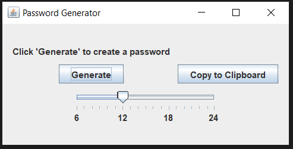

# PassGene

Simple UI Java program to generate a random passwords

To download the executable JAR File: <a href="https://github.com/mubakhit/PassGene/raw/main/JAR/PasswordGenerator.jar" download>Click here</a>

Note!

You should have at least Java JDK 14 to run the code or to execute the JAR file.
<<<<<<< Updated upstream
<a href="https://www.oracle.com/java/technologies/javase/jdk19-archive-downloads.html" download>To download java click here</a>
=======

<h1>Screenshots</h1>

>>>>>>> Stashed changes
